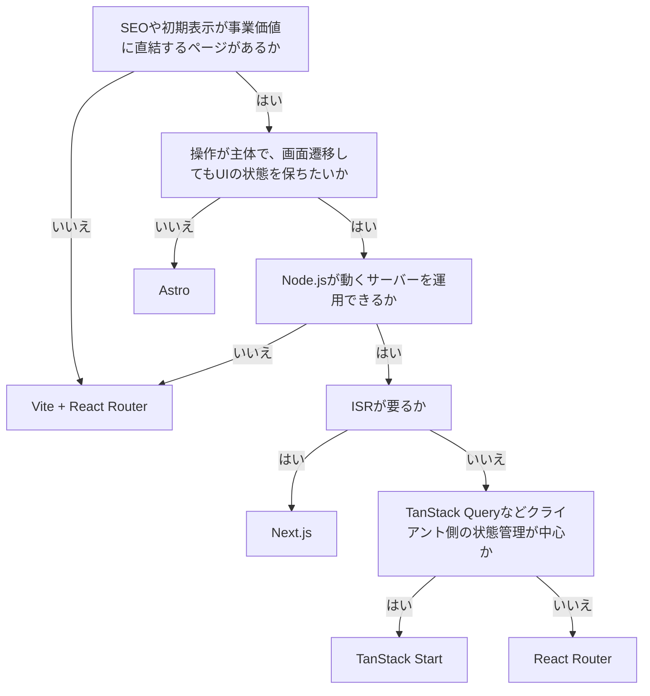

# フレームワーク選定

Reactアプリをどの構成で作るかの判断。
どのレンダリング戦略が要るかは[レンダリング戦略](./rendering-strategies.md)を参照。

## 判断の軸

- SEOや初期表示が事業価値に直結するページがあるか。
- チームがサーバーとクライアントの境界を扱えるか。

最初の軸で決まることが多い。SSRが要らないなら、以降は検討するまでもなくSPAでよい。

SPAにするのは、要件を満たす中で最も単純な構成だから。
SSRで得られるものが無い一方、サーバーの運用とサーバー／クライアント境界の設計というコストは残る。
ただし、既にチームがNext.jsやReact Routerに慣れている、将来SSRが要る見込みがある、といった場合は、それらをSPAモードで使う選択肢もある。

## 選択肢

| 構成                          | 対応するレンダリング戦略 |
| ----------------------------- | ------------------------ |
| Next.js                       | SSG, ISR, SSR, CSR       |
| React Router (framework mode) | SSG, SSR, CSR            |
| TanStack Start                | SSG, SSR, CSR            |
| Vite + React Router (SPA)     | CSR                      |
| Astro                         | SSG, SSR                 |

### Next.js

- ISRを持つ。
  ページ数が多くビルド時に全部生成できず、かつリクエストごとの鮮度は要らない場合に効く。React構成でこれが要るならほぼ一択。
- App RouterではRSCがデフォルト。実装が最も成熟していて情報も多い（RSC自体はReactの機能で、React RouterやTanStack Startにもある）。
- `next/image`が手厚い。ユーザー投稿のようなビルド時に存在しない画像も最適化できる。

### React Router (framework mode)

- SSRとルーティングに絞られていて、学習量が少ない。
- ルート単位のloader / actionでデータ取得をサーバーに寄せられる。

### TanStack Start

- 型付けとTanStack Queryとの統合が厚い。
- サーバー関数とルートローダーでデータ取得をサーバーに寄せられる。

### Vite + React Router (SPA)

- SPA専用。構成が単純で開発時のビルドも速い。
- サーバーを持たないので、静的配信だけで運用できる。

### Astro

- JSを送らない静的ページに強い。
- クライアントルーティングや画面をまたぐ状態共有は苦手。

### フローチャート

## サーバーが要るケース

コンテンツ主体のサイト（メディア、ブログ、コーポレート）

- 検索流入が価値の中心で、SEOと初期表示が直接効く。
- 更新頻度が低くビルド時に生成できるので、サーバー負荷が小さい。
- ページ数が少なく静的なら、Astroのほうが軽くビルドも速い。

EC、マーケットプレイス、求人・不動産のような一覧と詳細を持つサービス

- 商品ページが大量にあり、時間差で再生成しつつCDNから配信したい。
- ISRが効くので、この用途はNext.jsが有利。

ログイン後の機能がメインだが、SSRが必要なページもあるSaaS

- LPやドキュメントは静的、ログイン後はクライアント主体、と1つの構成で両立できる。

認証トークンをhttpOnly cookieで持ちたい

- BFFとしてサーバーが要るケース。詳細は[Auth](../auth.md)を参照。

集計や整形が重い表示画面

- 帳票やレポートのように、表示が主で操作が少ない画面。
  集計処理と重い依存をサーバーに置けるので、クライアントに送るJSが減る。

## サーバーが要らないケース

認証必須の管理画面、社内ツール

- SEOが不要で、初期表示のHTMLに価値がない。
- 状態がクライアント側にあり、結局大半がクライアントコンポーネントになる。

エディタ、チャット、描画ツール

- 画面がほぼ全てインタラクションで、WebSocketなどクライアント主体の通信が中心。
