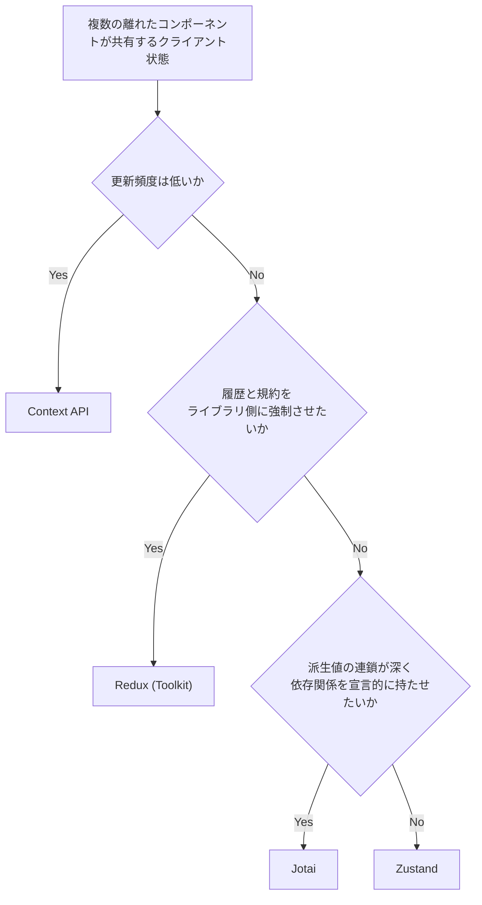

# React.jsにおけるグローバルな状態管理

## サーバー状態とクライアント状態を分ける

API から取得したデータ（サーバー状態）は TanStack Query や SWR などのデータフェッチライブラリが担当する。
サーバー状態まで状態管理ライブラリで持つと、キャッシュ・再取得・楽観的更新を自前で実装することになる。

## 導入の判断

次の状態は状態管理ライブラリを使わない。

- サーバー状態: TanStack Query / SWR が持つ。
- URL に載る状態（フィルタ・ソート・ページ）: URL クエリ（`nuqs`）。
- フォームの入力途中: React Hook Form などフォームライブラリのローカル状態。
- 1つのコンポーネントとその子で完結する状態: `useState` / `useReducer` + props。
- めったに変わらない値の配布（テーマ・ロケール・ログインユーザー）: Context API。
  実際には `next-themes` や i18n ライブラリ、認証ライブラリの hook を使うことが多いが、
  いずれも内部は Context なので位置づけは変わらない。
  更新頻度が低くセレクタによる最適化の旨みがないため、ここに Zustand などを入れる理由は薄い。

残るのは「複数の離れたコンポーネントが共有し、かつ頻繁に更新されるクライアント状態」だけであり、ここでライブラリを検討する。

- props のバケツリレーが3〜4階層を超え、中間コンポーネントが使わない props を素通ししている。
- Context に載せたが、value 更新のたびに購読側が広範囲に再レンダリングされ、Context の分割だけでは対応できない。
- React ツリーの外（イベントハンドラ・WebSocket の受信・非同期処理）から状態を読み書きしたい。
- 状態遷移の履歴を追いたい / 複雑な更新フローを規約で縛りたい。

再レンダリングが実測で問題になってから導入する。

## Context API

React 標準。ライブラリを追加せずに props のバケツリレーを解消できる。

- value が変わると、その Context を購読しているコンポーネントが**すべて**再レンダリングされる。
  値の一部しか使っていなくても再レンダリングされるため、頻繁に更新される値には向かない。
- 更新頻度の異なる値は Context を分割する。state と dispatch を別 Context にするのは定番。
- テーマ・ロケール・ログインユーザーなど、めったに変わらない値の配布に向く。
  これらを Jotai や Zustand で持つこともできるが、更新頻度が低く最適化の旨みがない。
  また、モジュールスコープの store は SSR でリクエスト間を跨いで共有されるため、
  ログインユーザーのような値はリクエストごとにスコープを切る必要がある。
  Context は元からツリー単位なのでこの問題が起きない。
- 状態管理ライブラリが Context を使う場合も、載せるのは**ストアの参照**だけで、値は載せない。
  購読は atom やセレクタ単位で行うため、Context value の変化による広範囲の再レンダリングは起きない
  （Jotai の `Provider` がこれ。Zustand はモジュールスコープの store を `useSyncExternalStore` で購読し、
  そもそも Context を使わない）。

## Redux

Flux アーキテクチャ。単一の store に状態を集約し、action を dispatch して reducer で更新する。

- すべての更新が action を経由することが**強制される**のが最大の性質で、利点はここから派生する。
  - 履歴が漏れなく直列に並び、Redux DevTools で追える。
    Redux では `cart/addItem` のような action 名と payload が必ず履歴に残る。
    DevTools 自体は Zustand の `devtools` ミドルウェアや `jotai-devtools` でも使えるが、
    Zustand の `set()` は名前が任意で、省略すると履歴に `anonymous` と並ぶ。
    さらに、1つの操作を `set()` 2回に分ければ履歴も2件になり、
    逆に無関係な複数の値を1回の `set()` で更新すれば1件にまとまる。
    履歴の1件が1つの意味ある操作に対応する保証がない。
  - slice / action / reducer という形が決まっているため、大きなチームでも書き方が揃う。
    Zustand や Jotai でも規約を決めれば揃えられるが、維持は lint やレビュー任せになる。
- ボイラープレートが多いのが難点。Redux Toolkit が前提で記述量はかなり減るが、
  Zustand や Jotai と比べれば依然として多い。

## Zustand

単一の store を持つが、Redux のような action / reducer の規約はない。

- Jotai が atom を積み上げるボトムアップなのに対し、こちらは store を分割するトップダウン。
- Provider が不要で、React の外（イベントハンドラや非同期処理）からも `store.getState()` で読める。
  React 外からの読み書きは Redux や Jotai でもできるが、追加の構成なしにできるのは Zustand だけ。
- セレクタで購読し、返す値が変わったときだけ再レンダリングされる（Redux の `useSelector` と同じ仕組み）。
- ボイラープレートが少なく、Redux ほどの規約を必要としない中規模までの実質的な第一候補。

## Jotai

atom（状態の最小単位）を定義し、それを組み合わせてグラフを組む。

- Zustand が store を分割するトップダウンなのに対し、こちらは atom を積み上げるボトムアップ。
- atom は識別子にすぎず、値は store が持つ。Provider を置けばその配下だけ別の store になり、
  atom の定義は共通のまま値だけが独立する（SSR のリクエスト分離、モーダルやタブごとの独立、一括リセット）。
  Provider を省略した場合はアプリ全体で共有される暗黙の store が使われる。
- atom 単位で購読するため、広範囲の再レンダリングが起きない。導出も atom の組み合わせで書く。
- ボイラープレートがほぼないため、Context の再レンダリング問題を解決したいだけのケースに向く。

同じ atom モデルの先行実装に Meta 製の Recoil があったが、2025年1月に公式にリポジトリがアーカイブされ開発終了。

## Zustand と Jotai の比較

どちらでもたいていのアプリは書けるため、基本は Zustand を選ぶ。
採用実績とドキュメントが多く、Provider も不要で最小構成のまま始められる。
React の外（イベントハンドラや非同期処理）から触る必要があるなら、なおさら Zustand が向く。
派生値の連鎖が深く、その依存関係を宣言的に持たせたい場合に Jotai を検討する。

### 設計

- Zustand はまず状態のまとまりを決め、その中に値と更新関数を同居させるトップダウン。
  状態同士の依存は更新関数の中で手続き的に書く。
  派生値の管理はないため、セレクタは store の更新のたびに実行される。
  重い計算は `useMemo` で包むか、更新時に派生値も一緒に store へ書き込む。
- Jotai は小さな atom を定義し、derived atom で依存グラフを宣言的に組むボトムアップ。
  派生値をいつ再計算するかはライブラリが管理する。
- 状態が機能単位でまとまっているなら Zustand、状態同士の依存が多いなら Jotai。
  - 前者は、値同士に計算上の依存がなく操作単位で更新されるもの。
    プレイヤーの再生位置・音量・再生中フラグなど。
  - 後者は、ある値から次の値が計算される連鎖があるもの。
    フィルタ条件 → 絞り込み結果 → 集計値 → グラフ用データなど。
  - ただし、Jotai で store のようにまとめることも、Zustand で派生値を書くこともできる。

```ts
// Zustand: 値と更新関数を1つの store にまとめ、派生値は取り出す側で計算する
const useCartStore = create((set, get) => ({
  items: [],
  coupon: null,
  addItem: (item) => set({ items: [...get().items, item] }),
}));

const total = useCartStore((s) => s.items.reduce((a, i) => a + i.price, 0));
```

```ts
// Jotai: 値を atom に分け、派生値も atom として宣言する
const itemsAtom = atom([]);
const couponAtom = atom(null);
const totalAtom = atom((get) => get(itemsAtom).reduce((a, i) => a + i.price, 0));
const payableAtom = atom((get) => applyCoupon(get(totalAtom), get(couponAtom)));
```

### 再レンダリング

- どちらも範囲を絞れるが、絞る単位が違う。
- Zustand は購読側がセレクタで指定するため、書き方次第で範囲が広がる。
- Jotai は atom の粒度がそのまま購読単位になるため、atom を分けた時点で範囲が決まる。
  逆に atom を粗く作れば同じ問題が起きる。
- チューニングの向きも違う。
  Jotai は最適化が atom の設計に組み込まれる代わりに、
  後から粒度を変えるとその atom を読んでいる箇所すべてに影響する。
  Zustand はセレクタの修正や `useMemo` の追加で、問題が出た箇所だけ局所的に直せる。
  派生関係が複雑なほど Jotai が有利で、そうでなければ Zustand で足りる。

```ts
// Zustand: 何を返すセレクタを書いたかで範囲が決まる
const count = useCartStore((s) => s.items.length); // items が変わったときだけ
const state = useCartStore(); // store 全体を購読するので coupon の更新でも再レンダリング

// Jotai: どの atom を読んだかで範囲が決まる
const [items] = useAtom(itemsAtom); // couponAtom を更新しても再レンダリングされない
```

### ユースケース

| 向いている状態                                           | 選択    |
| -------------------------------------------------------- | ------- |
| モーダル・トースト・サイドバーなどのグローバルな UI 状態 | Zustand |
| WebSocket や外部 SDK など React の外と同期する状態       | Zustand |
| ウィザードのように、まとまりで扱う一連の状態             | Zustand |
| フォームやエディタなど、要素単位で頻繁に更新される状態   | Jotai   |
| 絞り込み結果や集計値のように、派生値が積み重なる状態     | Jotai   |
| キャンバスや表の各セルなど、多数の独立した状態           | Jotai   |

## 選定基準

| 状況                                       | 選択            |
| ------------------------------------------ | --------------- |
| めったに変わらない値をツリー全体に渡す     | Context API     |
| atom を積み上げて組みたい                  | Jotai           |
| store をまとめて持ち、最小構成で済ませたい | Zustand         |
| 履歴と規約をライブラリ側に強制させたい     | Redux (Toolkit) |


