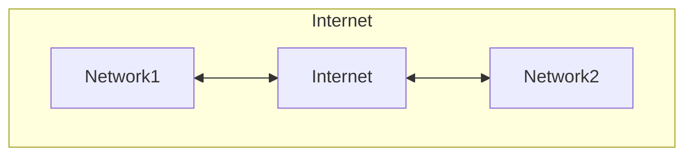

# Network

## インターネット

インターネットとは、個々のネットワークを繋いで形成される巨大なネットワークの集合体。

## IPアドレス

インターネットで使われているプロトコルはTCP/IP。そのプロトコルでは、通信先を特定するのにIPアドレスを使う。

<8bit>.<8bit>.<8bit>.<8bit>の32bitで構成される。

IPアドレスの範囲は2 ** nで区切る。

IPアドレス範囲の、前半の共通部分をネットワーク部、後半をホスト部という。

### CIDR表記

IPアドレスの範囲を、ネットワーク部のビット長で表す表記。このビット長をprefixという。
例えば10.0.0.0/24の場合、24という数字はネットワーク部の範囲の24bitのことで、ホスト部の範囲は残りの8bit(32 - 24)になる。
ホストとは、コンピュータ、サーバ、ルータ、クライアントなど、IPアドレスを持つネットワークデバイスのこと。

CIDR表記のIPアドレスの範囲をCIDRブロックという。

### グローバルIPアドレス(パブリックIPアドレス)

インターネットに接続する際に使うIPアドレス。

### プライベートIPアドレス

プライベートネットワーク内でのみ有効なIPアドレス。

| クラス | IPアドレス(CIDR表記) |
| ------ | -------------------- |
| A      | 10.0.0.0/8           |
| B      | 172.16.0.0/12        |
| C      | 192.168.0.0/16       |

## パケット

TCP/IPでは、データを細切れにしたパケットという単位でデータを送受信している。
パケットにはヘッダー情報とデータが含まれている。

- ヘッダー
  - 送信元IP
  - 宛先IP
  - ...

## ルータ

TCP/IPでは、ルータが宛先IPを見て、もっとも宛先IPに近いネットワークへと転送していく。

## ssh

ssh接続は、サーバにリモートでログインして、各種設定をするための接続方法。
