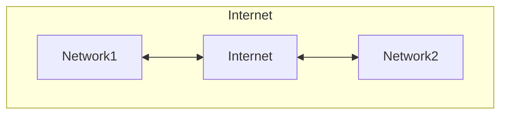

# Network

## インターネット

インターネットとは、個々のネットワークを繋いで形成される巨大なネットワークの集合体。

## IPアドレス

インターネットで使われているプロトコルはTCP/IP。そのプロトコルでは、通信先を特定するのにIPアドレスを使う。

<8bit>.<8bit>.<8bit>.<8bit>の32bitで構成される。

IPアドレスの範囲は2 ** nで区切る。

### グローバルIPアドレス(パブリックIPアドレス)

インターネットに接続する際に使うIPアドレス。

### プライベートIPアドレス

プライベートネットワーク内でのみ有効なIPアドレス。
