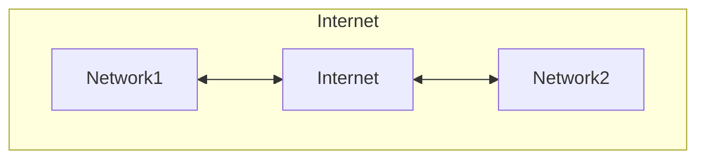

# Network

## インターネット

インターネットとは、個々のネットワークを繋いで形成される巨大なネットワークの集合体。



## IPアドレス

インターネットで使われているプロトコルはTCP/IP。そのプロトコルでは、通信先を特定するのにIPアドレスを使う。

<8bit>.<8bit>.<8bit>.<8bit>の32bitで構成される。

IPアドレスの範囲は2 ** nで区切る。

IPアドレス範囲の、前半の共通部分をネットワーク部、後半をホスト部という。

### CIDR表記

IPアドレスの範囲を、ネットワーク部のビット長で表す表記。このビット長をprefixという。
例えば10.0.0.0/24の場合、24という数字はネットワーク部の範囲の24bitのことで、ホスト部の範囲は残りの8bit(32 - 24)になる。
ホストとは、コンピュータ、サーバ、ルータ、クライアントなど、IPアドレスを持つネットワークデバイスのこと。

CIDR表記のIPアドレスの範囲をCIDRブロックという。

CIDRブロックにおいて以下のアドレスは予約されているので、ホストにこれらのIPアドレスは使用できない。

- `x.x.x.0`: ネットワークアドレス。すべてのネットワークを示す
- `x.x.x.1`: AWS VPCで予約されている
- `x.x.x.2`: AWS VPCで予約されている
- `x.x.x.3`: AWS VPCで予約されている
- `x.x.x.255`: ブロードキャストアドレス。すべてのホストを示す

### グローバルIPアドレス(パブリックIPアドレス)

インターネットに接続する際に使うIPアドレス。

### プライベートIPアドレス

プライベートネットワーク内でのみ有効なIPアドレス。

| クラス | IPアドレス(CIDR表記) |
| ------ | -------------------- |
| A      | 10.0.0.0/8           |
| B      | 172.16.0.0/12        |
| C      | 192.168.0.0/16       |

## パケット

TCP/IPでは、データを細切れにしたパケットという単位でデータを送受信している。
パケットにはヘッダー情報とデータが含まれている。

- ヘッダー
  - 送信元IP
  - 宛先IP
  - ...

## ルータ

TCP/IPでは、ルータが宛先IPを見て、もっとも宛先IPに近いネットワークへと転送していく。

### ルーティングプロトコル

インターネットでは、ルータ同士が通信してルートテーブルの情報を交換し、更新している。
この仕組みをルーティングプロトコルといい、EGPとIGPの2つがある。

#### EGP(Exterior Gateway Protocol)

ISPやAWSなどの大きなネットワークは、ネットワークを管理するためのAS番号(Autonomous System)を持っている。

EGPでは、AS番号をやりとりして、どのネットワークの先にどのネットワークが接続されているのかを大まかにやりとりする。

#### IGP(Interior Gateway Protocol)

ISP内やAWS内での詳細なやりとりに使われる。

## ssh(Secure SHell)

ssh接続は、サーバにリモートでログインして、各種設定をするための接続方法。

Macの場合は、ターミナルからsshクライアントを起動できる。

サーバでは、ssh接続を受け付けるsshdというプログラムが動いている。
Amazon Linuxでは、サーバが起動する際にsshdも起動するようになっている。

## ポート(port)

TCP/IPで通信するホストには、他のホストとデータを送受信するためのデータの出入り口が用意されており、これをポートという。
マンションの部屋番号のようなもの。

16bitである。

ポートには、TCPとUDPがある。

### TCP

相手にデータが届いたことを保証する。

### UDP

確認せずに送信するため高速である。

### ウェルノウンポート(well-known port)

特定のサービスのポート番号。

| well-known port | daemon     |
| --------------- | ---------- |
| 22              | SSH        |
| 53              | DNS        |
| 80              | HTTP       |
| 443             | HTTPS      |
| 3306            | MySQL      |
| 5432            | PostgreSQL |

### エフェメラルポート(ephemeral ports)

クライアント側で使われる一時的なランダムなポート。
通信開始時にランダムなポートが設定され、切断すると解放される。

## ファイアウォール(Firewall)

不正アクセスやサイバー攻撃からネットワークを守るためのシステム。
通してよい通信だけを通し、それ以外を遮断する。

### パケットフィルタリング(packet filtering)

パケットを見て、通過の可否を決めるしくみ。
パケットに付随する各種情報を見て、通過の可否を決める。

- IPアドレス
- ポート
- 通信種別(ICMP, TCP, UDPなど)
- 通信の方向
- ...

もっとも簡単な構造のファイアウォール。

ルータやサーバや専用のファイアウォール機器がパケットフィルタリングを構成する。

## ドメイン名

<www.example.co.jp>

`.`で区切られた部分をラベルという。
jpから左に向かって、それぞれ、トップレベルドメイン、第2レベルドメイン...と呼ぶ。

DNS名、ホスト名、DNSホスト名とも呼ばれる。

### DNS

DNSサーバがドメイン名をIPアドレスに変換する。

#### DNSサーバの動きを確認する

nslookupや、詳細に確認できる新しいコマンドdigを使う。

```sh
nslookup <hostname>
nslookup <ip address>
```
